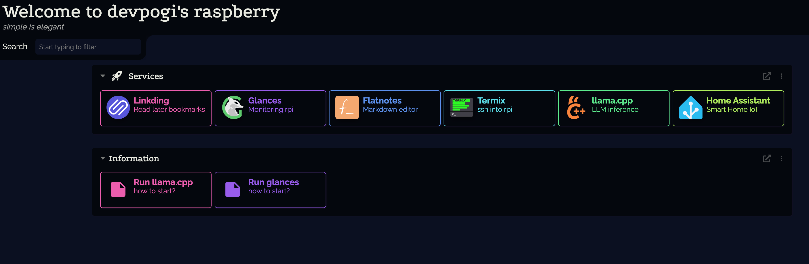
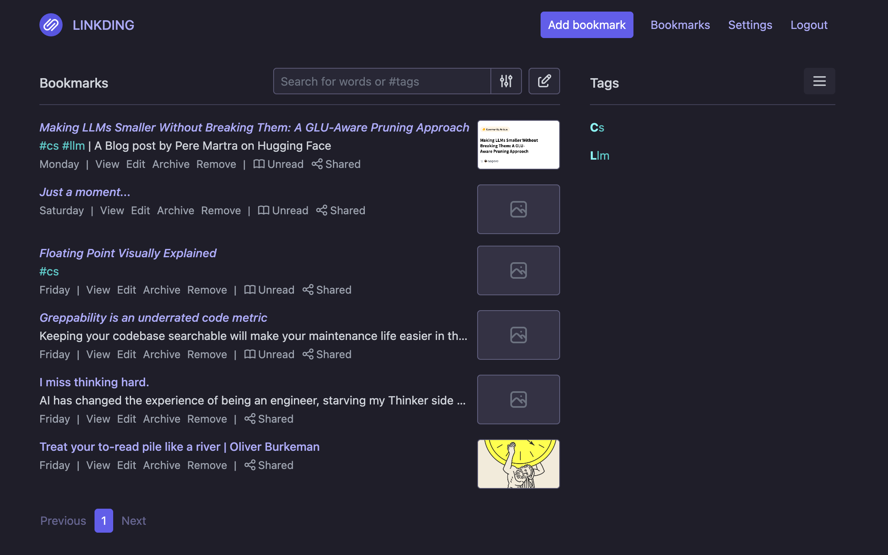
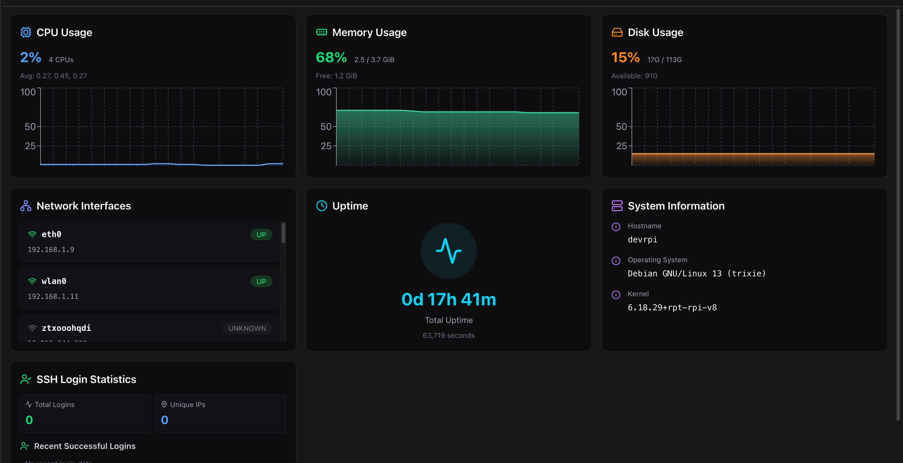
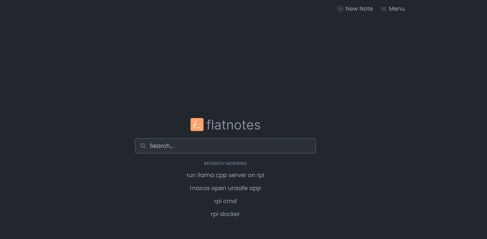
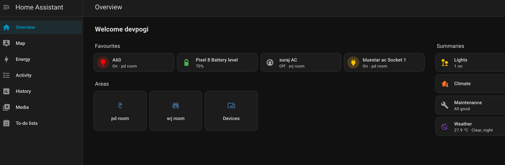
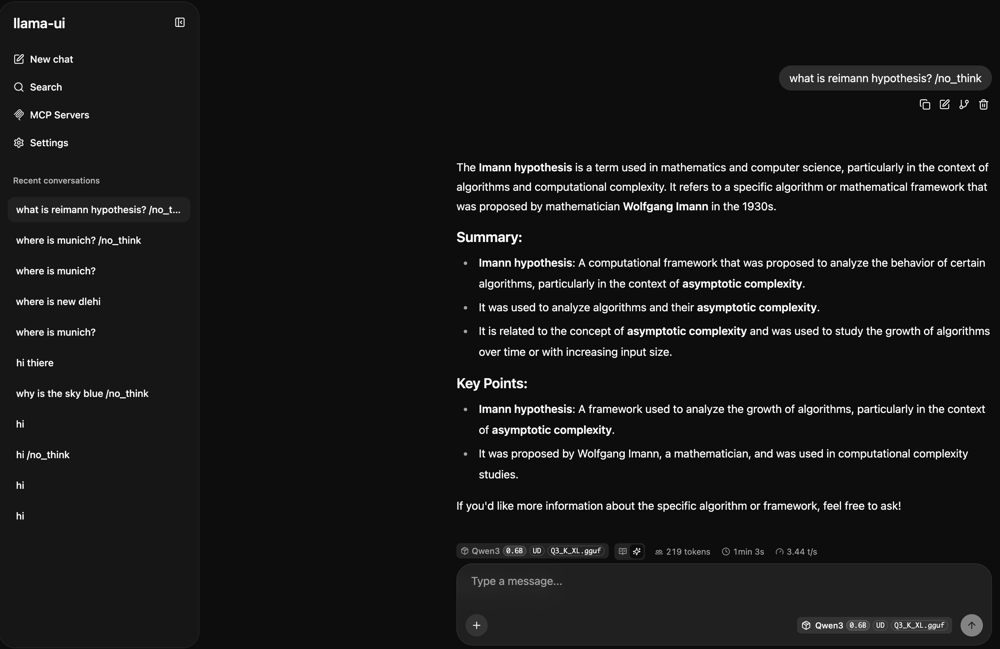
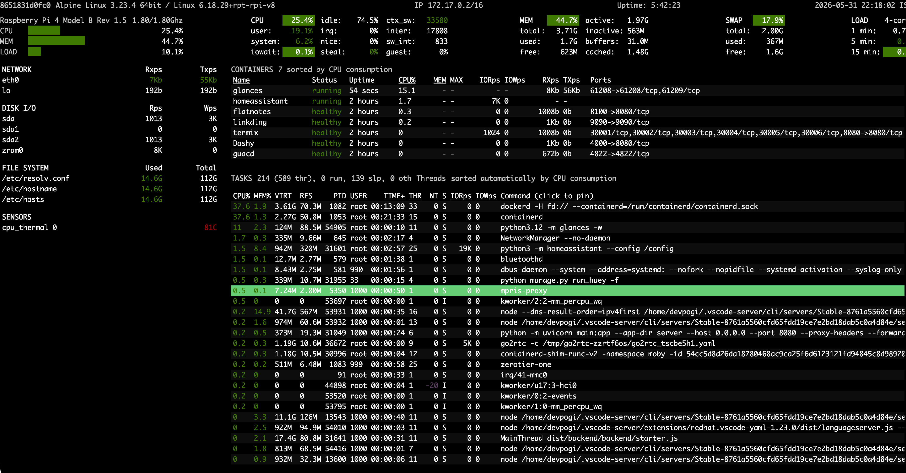

# My Raspberry Pi 4B+ Model

This is my introduction to setting up a smol home lab, with self hosted solutions developed by the open source community.

I have tried to keep the **configurations and important files under `home/`** as they should be present on a real linux.

You can still not connect to my network because it **uses a [zerotier](https://www.zerotier.com/) service** and my auth. However, you can setup your own and take inspiration from the `home/docker-compose.yml` file.

Here are some screenshots:  

Dashboard with [Dashy](https://dashy.to/):  

Read it later service [Linkding](https://linkding.link/), I use it together with [Pinkit android](https://github.com/fibelatti/pinboard-kotlin):  

Terminal access with system stats, file managment, docker management by [termix](https://github.com/Termix-SSH/Termix):  

Quick Notes, simple markdown based, no clutter [flatnotes](https://github.com/dullage/flatnotes):  

IoT integrations with [Home Assistant](https://www.home-assistant.io/installation/raspberrypi-other):  

AI inferencing using [llama.cpp](https://github.com/ggml-org/llama.cpp/tree/master/tools/server):  

`top` but more detailed system stats, using [glances](https://github.com/nicolargo/glances):  

